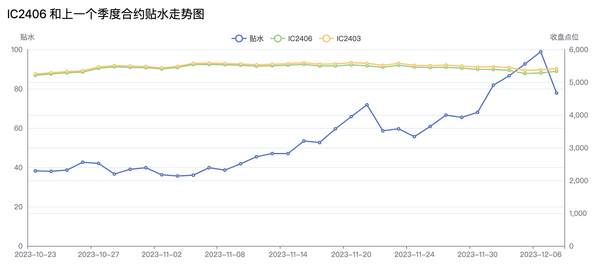

## 滚 IC 策略简述

熟悉中证 500 股指期货（IC）的朋友，大部分都知道 IC 相对 IF（沪深 300）来说，有持续性的贴水，就是说远月合约的点数比近月合约要便宜。这样每次在合约到期前将其换成远月合约，就能持续降低 IC 的持有成本。

假如年初指数为 6000 点，持有的 1 月合约点位是 6000 点，2月合约有 30 点贴水（即 5970 点）。卖出 1 月合约，买入 2 月合约，就可以赚到 30 点。等到 2 月，指数价格不变，2 月合约点位涨到 6000 点，3 月合约仍有 30 点贴水。这时再卖出 2 月合约，买入 3 月合约又可以赚到 30 点。

这样不断地卖出近月，买入远月 IC 合约的策略，俗称滚 IC。它赚的是持续的远月合约贴水的钱，最大风险是指数本身的涨跌，由于带有杠杆，指数本身涨跌比滚 IC 贴水的部分大很多，需要谨慎使用。

## 如何换月

既然远期 IC 合约有贴水，买入远期，卖出近期合约就可以完成。那什么时候操作比较合适，是按月换还是按季度换，就是一个问题。考虑到每次换月都会有损耗，包括买卖手续费，操作期间指数本身的涨跌。我一般都是操作季度合约，这样每 3 个月操作一次就可以。

但什么时候切换，可以吃到更多的贴水呢？之前基本都是凭感觉，什么时候想到就换了，没有数据的支撑。比如上个月看到贴水比较低，担心后面会越来越低。于是在 IC2406 合约刚上市时就换了，结果这个月贴水又再持续提升，感觉亏了一个亿。

于是去找到历史数据，做了些分析，把每个季度合约和上一个季度合约的点位做对比，做出走势图，以便直观的看到规律。所以有了下面的季度合约贴水走势图，拿出来和需要的朋友共享。

## 指标数据

在图中列出了 4 个指标，分别是：

- 贴水点数 = 季度合约点数 - 上一季度合约点数
- 远月季度合约点数
- 上一个季度合约点数
- 年化收益 = (上一个季度合约点数 / 季度合约点数 - 1) * 4

注意：
1. 年化收益是以保证金 100% 计算的，如果 25% 保证金，则收益会提升 4 倍。
2. 没有考虑指数本身的价格变动

指标示例：

更多历史合约指标请，可以点击 [查看全部历史合约指标（持续更新）](/ic-discount/) 。

## 数据来源

所有数据均来自于官方的 [中金所历史数据下载](http://www.cffex.com.cn/lssjxz/) ，以每日收盘价作为计算因子。
